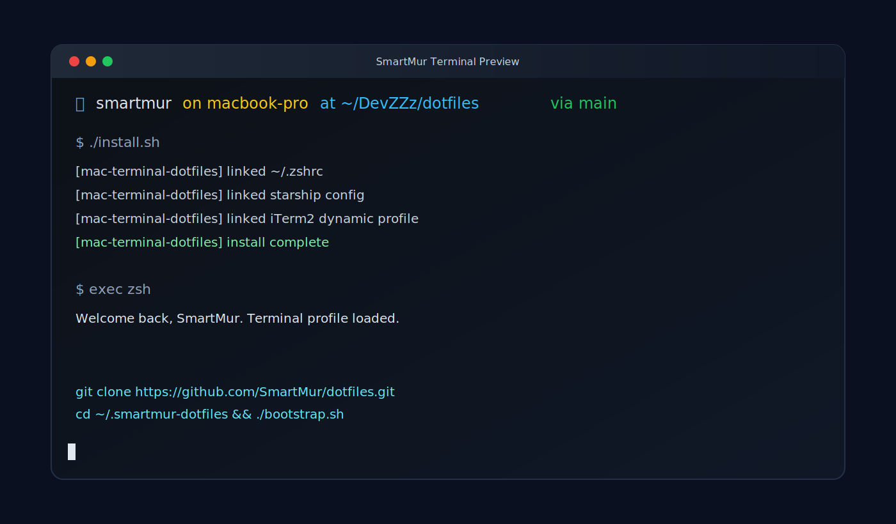
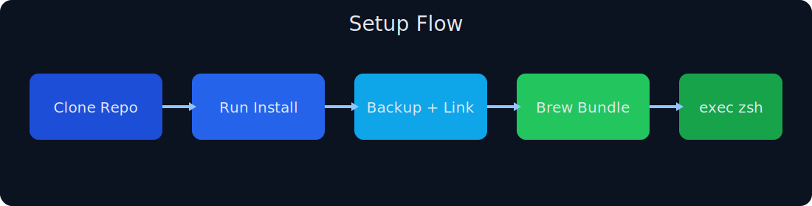

<p align="center">
  
</p>

<p align="center">
  
</p>

# SmartMur Dotfiles (macOS Terminal)

[](https://www.apple.com/macos/)
[](https://www.zsh.org/)
[](LICENSE)
[](https://github.com/SmartMur/dotfiles)

Production-ready macOS terminal dotfiles with reproducible setup, safe backups, Homebrew package management, and iTerm2 profile/theme automation.



Start here: `docs/GETTING_STARTED.md`  
Contributing: `CONTRIBUTING.md`  
Security policy: `SECURITY.md`  
Roadmap: `ROADMAP.md`

## Overview

This repository captures your preferred terminal environment so it can be applied consistently on any Mac.

- Symlink-based dotfile management
- Automatic backup of previous local configuration
- Homebrew dependency installation from `Brewfile`
- Starship prompt and iTerm2 profile/theme setup
- Clear separation of secrets from version-controlled files

## Repo Structure

```text
.
├── Brewfile
├── LICENSE
├── bootstrap.sh
├── install.sh
├── assets/images/
├── config/.config/
│   ├── iterm2/
│   └── starship.christianlempa.toml
└── zsh/
    ├── .zshrc
    └── .zsh/
        ├── aliases.christianlempa.zsh
        ├── functions.christianlempa.zsh
        ├── nvm.christianlempa.zsh
        └── starship.christianlempa.zsh
```

## Requirements

- macOS 13+
- `zsh` (default on macOS)
- Xcode Command Line Tools
- Homebrew
- Git

## Quick Start

```bash
git clone https://github.com/SmartMur/dotfiles.git mac-terminal-dotfiles
cd mac-terminal-dotfiles
./install.sh
exec zsh
```

<p align="center">
  
</p>

## Professional Checks (Before Push)

```bash
bash -n bootstrap.sh
bash -n install.sh
python3 scripts/security_scrub.py
```

## One-Line Bootstrap (Fresh Machine)

```bash
/bin/bash -c "$(curl -fsSL https://raw.githubusercontent.com/SmartMur/dotfiles/main/bootstrap.sh)"
```

The bootstrap script installs prerequisites if needed, clones this repo into `~/.smartmur-dotfiles`, and runs `install.sh`.

## What `install.sh` Does

- Creates timestamped backups in `~/.terminal_backups/mac-terminal-dotfiles-<timestamp>/`
- Symlinks repo-managed files into `~/.zsh*`, `~/.config/*`, and iTerm2 Dynamic Profiles
- Sets the iTerm2 default profile GUID to the SmartMur profile
- Runs `brew bundle --file Brewfile` unless `--skip-brew` is passed

## iTerm2 and Branding

- Dynamic profile location:
  - `~/Library/Application Support/iTerm2/DynamicProfiles/christianlempa.dynamic.json`
- Additional profile assets:
  - `~/.config/iterm2/christianlempa.itermcolors`
  - `~/.config/iterm2/christianlempa-profile.json`

Brand assets copied from `https://smartmur.ca` on February 18, 2026:

- `assets/images/smartmur-white.png`
- `assets/images/smartmur-favicon.png`

## Customization

- Core shell behavior: `zsh/.zshrc`
- Aliases/functions modules: `zsh/.zsh/*`
- Prompt style: `config/.config/starship.christianlempa.toml`
- Package list: `Brewfile`

After changing files in this repo:

```bash
./install.sh --skip-brew
exec zsh
```

## Secrets and Security

Never commit API keys or tokens.

Use a local-only file:

- `~/.zsh/secrets.zsh`

Example:

```bash
export OPENAI_API_KEY="..."
```

## Troubleshooting

- Prompt/theme not updating: run `exec zsh`
- iTerm2 profile not switching: restart iTerm2 and open a new window
- Missing packages: run `brew bundle --file Brewfile`
- Rollback required: restore files from `~/.terminal_backups/...`

## Maintenance Workflow

```bash
git pull
./install.sh --skip-brew
exec zsh
```

## Contributing

See `CONTRIBUTING.md`.

## License

MIT License. See `LICENSE`.
